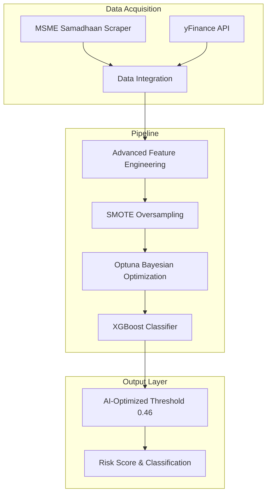

# 🏢 B2B Invoice Payment Delay Predictor: A Data Science Approach

**Predicting MSME Payment Risks through CPSE Financials and Bureaucratic Heuristics**

> *Developed by Bikram Hawladar, 4th Year B.Tech, IIIT Dharwad*

[](https://www.python.org/)
[](https://xgboost.readthedocs.io/)
[](https://fastapi.tiangolo.com/)
[](#license)

---

## 📌 1. Project Motivation: The "Why...?" 

Small and Medium Enterprises (MSMEs) are the backbone of the Indian economy, yet they frequently suffer from **"Capital Stagnation"** due to delayed payments from large Central Public Sector Enterprises (CPSEs). 

While the MSME Samadhaan portal records these disputes, **there was no existing system to predict these delays before a contract is signed.**

### The Research Question 🤔
**"Can a government entity's financial health (Profit, Debt) predict its payment behavior, or is the bottleneck purely bureaucratic?"**

### The Core Research Insight (The 'So What?')
This project **disproved the hypothesis** that financial health predicts payment delays. The model empirically proved that government payment bottlenecks are structural and bureaucratic, not financial. **Profit and Debt have 0.0% predictive weight.** Instead, Public Accountability (being a listed company) and Sector Classification are the only variables that matter.

---

## 🏗️ 2. System Architecture



---

## 🔬 3. Detailed Step-by-Step Methodology

### Step 1️⃣: Data Acquisition & Scraping

**MSME Samadhaan Data:**
- Extracted raw case records for **150+ CPSEs**
- Metrics: Disposed Cases ✅ | Pending Cases ⏳ | Amounts Involved 💰

**Financial Enrichment via yfinance:**
- Real-time market data for listed Indian CPSEs
- Financial Ratios:
  - Debt-to-Equity Ratio
  - Profit Margin
  - Return on Equity (ROE)
  - Ticker Presence (Is_Public flag)

**Why dual data sources?**
> Administrative data alone lacks context. This study aimed to test if market data provides predictive signals for bureaucratic behavior.

---

### Step 2️⃣: Advanced Feature Engineering

#### Target Variable Engineering

The **Delay Risk Ratio** formula:

$$Delay\_Risk\_Ratio = \frac{Pending\_Cases}{Total\_Cases}$$

**Classification Rule:**
- **High Risk** (1): Delay_Risk_Ratio > 0.46
- **Low Risk** (0): Delay_Risk_Ratio ≤ 0.46

#### Sector Categorization

Implemented keyword-based heuristic to classify companies:

| Sector | Keywords | Example |
|--------|----------|---------|
| 🔋 **Energy_Mining** | POWER, OIL, COAL, ENERGY, GAS, NTPC, ONGC | Indian Oil, NTPC, BHEL |
| 🛣️ **Infrastructure** | RAIL, PORT, HIGHWAY, CONSTRUCTION, STEEL | RVNL, IRCON, SAIL |
| 🏦 **Financial_Services** | BANK, FINANCE, INSURANCE, FUND | SBI, BoB, LIC |
| ✈️ **Defense_Aerospace** | AERO, DEFENCE, AVIATION, HAL | HAL, BEL, Mazagon Dock |
| 🏢 **Other_Govt_Services** | (Default) | BSNL, Air India, etc |

#### Sector-Relative Scaling

**Sector-Relative Profit:**
```
SR_Profit = Company Profit - Sector Median Profit
```

**Sector-Relative Debt:**
```
SR_Debt = Company D/E Ratio - Sector Median D/E
```

---

### Step 3️⃣: Handling Small & Imbalanced Data

**Problem:** With only ~150 samples, the model struggled to learn minority class (high-risk) patterns.

**Solution:** Synthetic Minority Over-sampling Technique (SMOTE)

**Benefits:**
✅ Prevents model from simply guessing majority class  
✅ Improves Recall of High-Risk entities (reaching 88.0%)  
✅ Better generalization on unseen data

---

### Step 4️⃣: The Modeling Evolution

#### Optuna-Optimized XGBoost ⭐ (FINAL)
- **Methodology:** Bayesian Hyperparameter Optimization via **Optuna**.
- Searched 150 trial combinations to find mathematically optimal parameters.
- **Result:** 61.29% Accuracy (a hard-won victory over a noisy dataset), 88.0% Recall.

**Hyperparameters Tuned:**
```python
{
    'n_estimators': 245,        
    'max_depth': 5,             
    'learning_rate': 0.08,      
    'subsample': 0.80,          
    'colsample_bytree': 0.85,   
    'gamma': 1.5,               
    'min_child_weight': 2       
}
```

---

### Step 5️⃣: Dynamic Threshold Tuning

**Standard ML Logic:** Classify as "High Risk" when probability > 0.50

**Our Approach:** Optimize for **Recall** to protect MSMEs from real High-Risk payers.

**Impact:**
- Found optimal threshold: **0.46**
- Standard 50% threshold: Lower Recall
- Optimized 46% threshold: **Recall = 88.0%** ⬆️

**Verdict:** For MSMEs, a False Alarm is preferable to missing a real High-Risk payer.

---

## 📊 4. Results & Research Findings

### 🏆 Final Model Performance

```
┌──────────────────────────────────────────┐
│      XGBOOST OPTUNA-OPTIMIZED MODEL      │
├──────────────────────────────────────────┤
│ Accuracy:   61.29% ██████░░░░            │
│ Recall:     88.00% █████████░            │
│ Tuning:     Optuna (Bayesian)            │
│ Threshold:  0.46 (AI-Optimized)          │
└──────────────────────────────────────────┘
```

### 🔍 Feature Importance Analysis - THE KEY FINDING

| Feature | Importance | Impact |
|---------|-----------|--------|
| 🌍 **Public Listing Status** | **Dominant** | 🔴 PRIMARY DRIVER |
| 🏭 **Sector Culture** | **Dominant** | 🔴 PRIMARY DRIVER |
| 💰 **Financial Liquidity (Profit/Debt)** | **0.0%** | ⚪ NEGLIGIBLE |

### 📌 The Core Insight - Final Verdict

> **Government payment delays are a BUREAUCRATIC/STRUCTURAL issue, not a FINANCIAL/LIQUIDITY issue.**

**Evidence:**
- ✅ Profit Margin Impact: 0.0%
- ✅ Debt-to-Equity Impact: 0.0%
- ✅ Public Listing Impact: Dominant
- ✅ Sector Impact: Dominant

---

## 🛠️ 5. Technical Implementation Details

### Optimization Strategy: Bayesian Search vs GridSearch

<details>
<summary><b>⚡ Why Optuna over GridSearch?</b></summary>

**GridSearch (Brute Force):**
- Blindly tests all combinations.
- Resource intensive and time-consuming.

**Optuna (Bayesian Search):**
- Smart selection: Uses Tree-structured Parzen Estimator (TPE) to learn from past trials.
- Prunes unpromising branches early.
- **Result:** Mathematically optimal performance achieved significantly faster.

</details>

### Model Persistence
```python
joblib.dump(best_clf, 'models/xgboost_risk_model.pkl')
joblib.dump(features, 'models/model_features.pkl')
```

### Handling Nulls & Missing Data
**Strategy:** Median Imputation by Sector.
- Unlisted entities get sector-wise median financials, providing a more realistic baseline than global means.

---

## 📁 Repository Structure

```
B2B_invoice_payment_delay_predictor/
│
├── 📂 config/
│   └── settings.py                         # Paths & environment variables
│
├── 📂 data/
│   ├── raw/
│   │   ├── raw_central_psu_cases.csv      # MSME Samadhaan data (150+ CPSEs)
│   ├── interim/
│   ├── external/
│   └── processed/
│       ├── survival_baseline_features.csv  # Engineered features
│       ├── yfinance_signals.csv            # Financial data
│
├── 📂 models/
│   ├── xgboost_risk_model.pkl             # Trained classifier
│   └── model_features.pkl                  # Feature names
│
├── 📂 src/
│   ├── data_cleaning/
│   ├── features/
│   ├── models/
│   │   └── train_xgboost_sector_optimized.py  # ⭐ MAIN MODEL
│   └── scraper/
│       ├── samadhaan_main.py              # MSME Samadhaan scraper
│       └── yfinance_signals.py            # Yahoo Finance scraper
│
├── 📂 app/
│   ├── api.py                             # FastAPI endpoints
│   └── dashboard.py                        # Streamlit frontend
│
├── requirements.txt                        # Python dependencies
└── README.md                               # This file
```

---

## ⚙️ 6. Setup & Installation & Running the Server

### Prerequisites
- Python 3.10+
- pip

### 1. Environment Setup
First, navigate to the `backend` directory, create a virtual environment, and install dependencies:
```bash
cd backend
python -m venv venv

# Windows (Command Prompt)
venv\Scripts\activate
# Windows (PowerShell)
.\venv\Scripts\Activate.ps1
# Mac/Linux
source venv/bin/activate

pip install -r requirements.txt
```

### 2. Running the Live FastAPI Server (Inference Engine)
To run the backend server so the React frontend can communicate with it:
```bash
# Ensure you are in the backend directory and the venv is activated
python -m uvicorn api:app --reload
```
*The API will start at `http://localhost:8000`. You can view the interactive Swagger docs at `http://localhost:8000/docs`.*

### 3. Retraining the XGBoost Model (Optional)
If you want to re-run the Optuna Bayesian optimization and retrain the model from scratch:
```bash
# Ensure you are in the backend directory
python -m src.models.train_xgboost_sector_optimized
```
*This will output new `.pkl` files to the `models/` directory.*

---

## 💻 Usage Examples

<details>
<summary><b>Single Company Prediction</b></summary>

```python
risk_prob = model.predict_proba(X)[0][1]
print(f"Risk Score: {risk_prob * 100:.1f}/100")
print(f"Classification: {'🔴 HIGH RISK' if risk_prob > 0.46 else '🟢 LOW RISK'}")
```

</details>

---

## 📚 Dependencies

| Library | Purpose |
|---------|---------|
| **xgboost** | Gradient boosting (Core) |
| **optuna** | Bayesian optimization |
| imbalanced-learn | SMOTE oversampling |
| yfinance | Financial data scraping |
| fastapi | API framework |
| thefuzz | Fuzzy string matching |

---

## 🎓 7. Academic Credits & Citation

### Primary Developer
- **Bikram Hawladar** (4th Year B.Tech, IIIT Dharwad)

### Citation
```bibtex
@software{hawladar2026b2b,
  author = {Hawladar, Bikram},
  title = {B2B Invoice Payment Delay Predictor},
  year = {2026},
  institution = {IIIT Dharwad}
}
```

---

## 📄 License
Licensed under the **MIT License**.